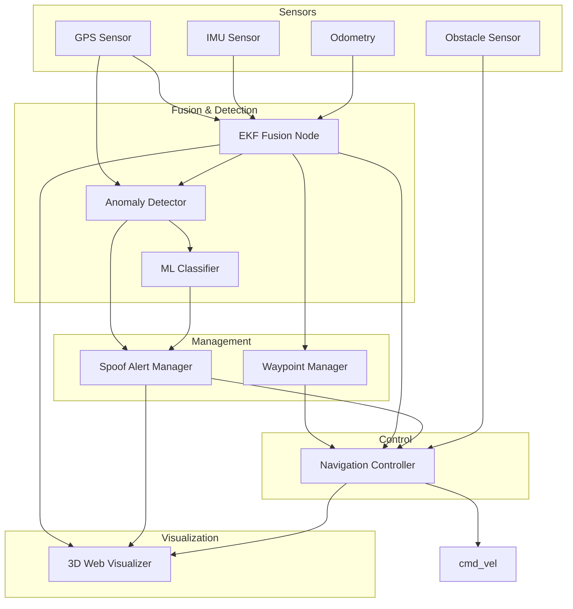

## 👥 Team Members
* **Chiranthan** - ChiranthanM512
* **Narasimha** -Narasimha5371
* **Jaidithya** - jd572


*


# 🛡️ Anti-Spoofing & Obstacle Avoidance Navigation System

A ROS2-based intelligent navigation system for autonomous cars. This project features multi-sensor fusion for accurate positioning, physics-based and machine-learning spoofing detection, and steering-based obstacle avoidance. It includes a high-fidelity 3D web simulation for testing and visualization.

---

## 🚀 Key Features

- **Sensor Fusion (EKF):** 6-state Extended Kalman Filter fusing GPS, IMU, and odometry data.
- **Spoofing Detection:** 
  - **Physics-Based:** Checks for velocity jumps and GPS-EKF drift.
  - **ML-Based:** Uses an LSTM model (with heuristic fallback) to classify spoofing probability.
- **Obstacle Avoidance:** Steering-based avoidance logic that allows the car to navigate around obstacles while maintaining its target route.
- **Dynamic Navigation Modes:** 
  - `NORMAL`: Standard waypoint following.
  - `ALERT`: Reduced speed and safe-stop preparation upon spoofing detection.
  - `SAFE_STOP`: Controlled deceleration to a full halt if spoofing persists.
- **3D Visualization:** Real-time city simulation in the browser via `rosbridge` and `Three.js`.

---

## 🏗️ System Architecture



---

## 🛠️ Setup & Installation

### Prerequisites
- **OS:** Ubuntu 22.04 with **ROS2 Humble** (or compatible)
- **Python:** 3.10+
- **Dependencies:** `pip install numpy pytest` (Torch optional for ML training)

### 1. Build the Workspace
```bash
# Create and build the package
mkdir -p ~/ros2_ws/src
cd ~/ros2_ws/src
# Clone/Link this repo here
colcon build --packages-select nav_antispoofing
source install/setup.bash
```

### 2. Start rosbridge (for Visualization)
```bash
ros2 launch rosbridge_server rosbridge_websocket_launch.xml
```

---

## 🏃 Running the Simulation

### 1. Launch the Full System
```bash
# Normal operation with obstacles enabled
ros2 launch nav_antispoofing full_system_launch.py
```

### 2. Run with Spoofing Attacks
```bash
# Simulate a sudden jump attack
ros2 launch nav_antispoofing test_spoofing_launch.py attack_mode:=sudden_jump
```
*Attack modes:* `gradual_drift`, `sudden_jump`, `replay`

### 3. Open the Frontend
- Open `simulation/index.html` in a modern web browser.
- Use a local web server for better performance: `python -m http.server` inside the `simulation/` directory.

---

## 📡 ROS2 Topics

| Topic | Type | Description |
|-------|------|-------------|
| `/gps/fix` | `NavSatFix` | Raw GPS readings |
| `/imu/data` | `Imu` | IMU measurements |
| `/odom` | `Odometry` | Wheel odometry |
| `/fused_pose` | `PoseStamped` | EKF fused position |
| `/other_cars` | `PoseArray` | Virtual obstacle positions |
| `/spoofing/alert` | `Bool` | Active spoofing alert status |
| `/nav/mode` | `String` | Navigation state (NORMAL/ALERT/SAFE_STOP) |
| `/cmd_vel` | `Twist` | Velocity commands sent to the vehicle |

---

## 🧪 Testing

Run core logic unit tests:
```bash
python -m pytest tests/ -v
```

---

## ⚙️ Configuration

Tweak system behavior in `config/nav_params.yaml`:
- **`max_linear_speed`**: Maximum cruising speed (default: 5.0 m/s).
- **`drift_threshold_m`**: Distance before GPS is considered spoofed (default: 10m).
- **`obstacle_positions`**: Define global coordinates for virtual obstacles.
- **`waypoints_json`**: Define the car's intended route.

---


## 📄 License
MIT License